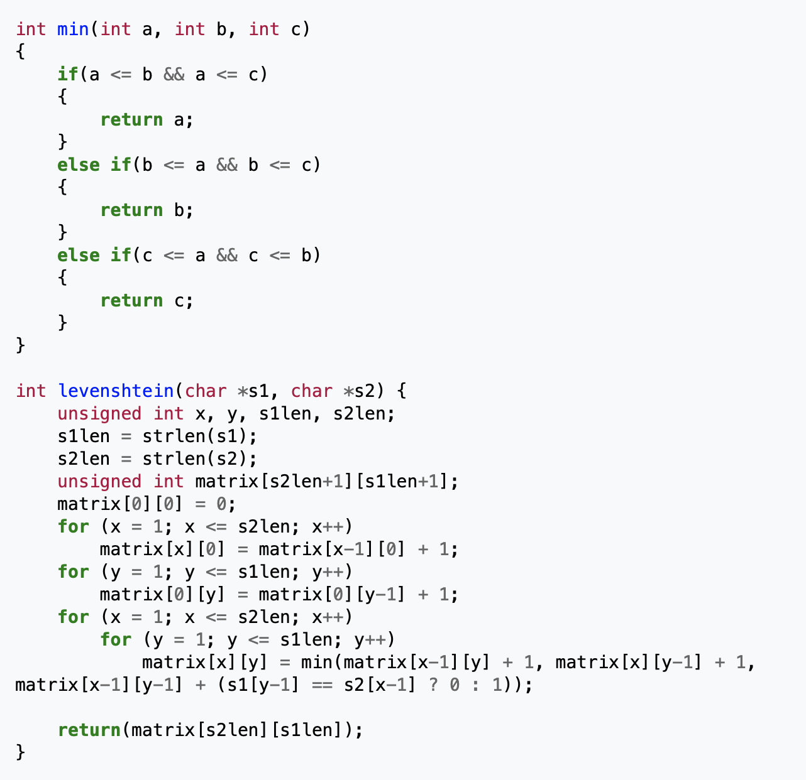
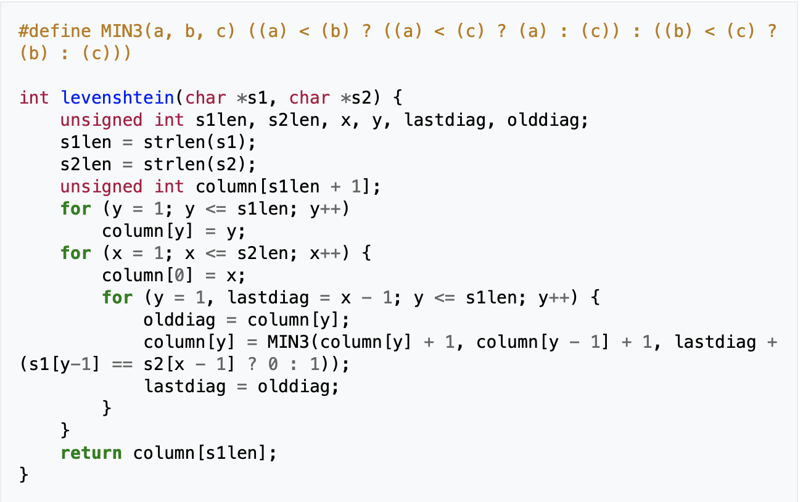

# Introduction

Pattern matching (including string matching, sequence matching...) is an important class of algorithms in Big Data and HPDA (High-Performance Data Analytics). 
For example, in bioinformatics, such algorithm applies to DNA sequence matching. Another domain of application is data mining. 
One example of pattern matching is exact string matching that is provided by tools like GNU grep. 
In addition, the target application of this project includes another parameters: the notion of approximation. 
Indeed, the notion of approximate matching allows a sequence to be found in a large database with some differences including insertion and deletion. 
Thus, the notion of distance is used to check if a match occurs or not between the searched pattern and the current processed text.

This code is based on the computation of the Levenshtein Distance (https://en.wikipedia.org/wiki/Levenshtein_distance) and more precisely on the C implementation available on Wikibooks here (https://en.wikibooks.org/wiki/Algorithm_Implementation/Strings/Levenshtein_distance#C).

To understand better the basics of the algorithm it's possible to read this article: https://www.andreaminini.com/informatica/programmazione/algoritmo-di-levenshtein

Here there is a simulator of the algorithm: https://www.let.rug.nl/~kleiweg/lev/

To adapt this notion of distance to our problem, we will consider the pattern as the first string s1 and the dna database as s2.
The previous function checks the distance of string s1 with string s2. 
In our case, it is only necessary to check the pattern size to check if there is a match starting at the beginning of the dna database. 
Then, by repeating the same algorithm for each possible match position (i.e., each character of the database), we can count the total number of matches depending on the target distance.

In addition to adapt the algorithm, we made the following changes:
- Allow matching of multiple patterns
- Allow the user to choose the maximum distance for matches
- Allocate the column array outside of the levenshtein function

# Source Code

- src/ : directory containing the source code apm.c 
- obj/ : directory that will contain the object files generated during the compilation process 
- dna/ : directory containing small dna sequences for testing 
- Makefile : File containing rules to compile the code

# Compilation

To compile the application, run the make command to generate the apm binary. 

# Execution

By launching the executable without argument, some help is printed.

./apm approximation_factor dna_database pattern1 pattern2

- The first argument approximation_factor is an integer that represents the distance allowed between the patterns and the match. 
- The second argument dna_database is a text file containing the big database in which the patterns are searched for. 
- The rest of the command line is dedicated to case-sensitive patterns.

Inside CLion: ./apm 1 ../dna/small_chrY.fa line_chrY.fa

# Test

To test the application, you can use the two small files located in the dna directory. 

To evaluate performance on larger database, you can download genome parts on this website (http://hgdownload.cse.ucsc.edu/downloads.html). 
For example, human chromosoms are available here (http://hgdownload.cse.ucsc.edu/goldenPath/hg38/chromosomes/). 

Download the FASTA format which is compatible with the application. Be careful about the size of each file and the time to read it from the NFS filesystem!

# Parallelism Hint

- You can distribute the patterns over the MPI ranks (matching of multiple patterns at the same time)
- Distributing the processing of one pattern is feasible (splitting the DNA sequence), but be careful about the patterns that occur at the frontier of two domains.
  
Of course both parallelism can be exploited at the same time with the parallel programming models like MPI, OpenMP or CUDA.